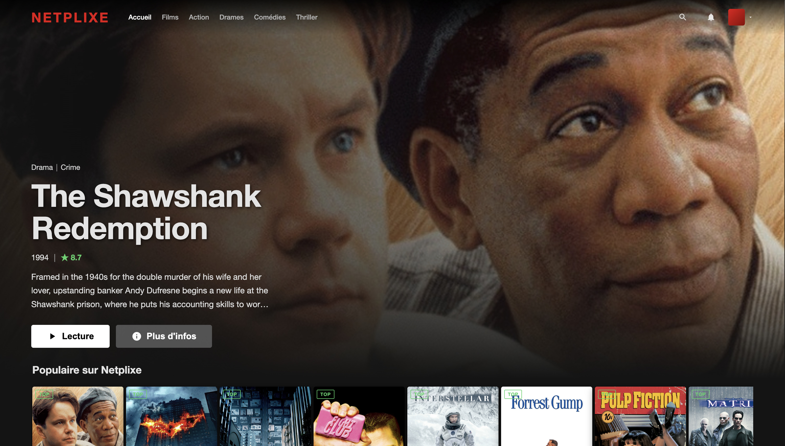
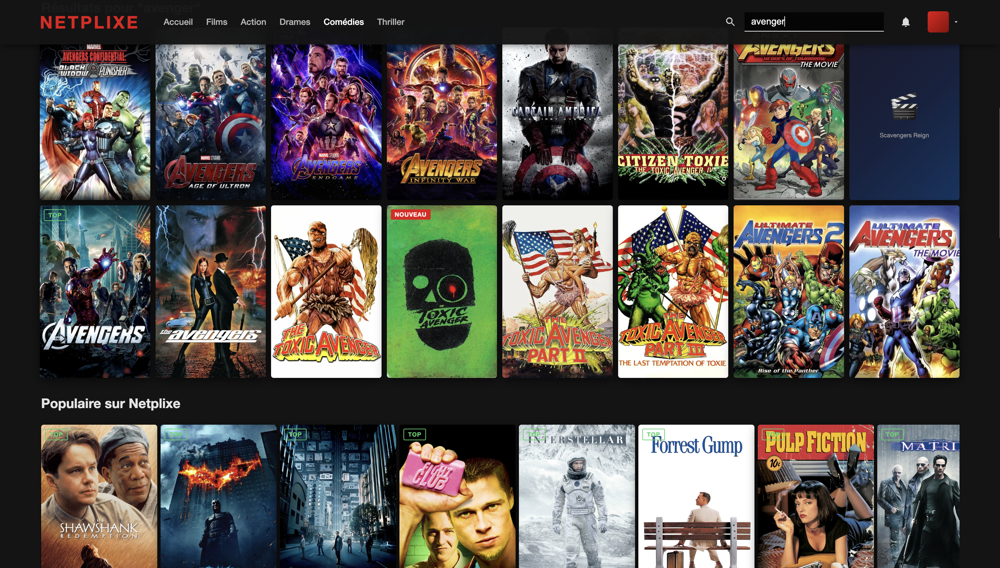

# Netplixe - Catalogue K8s 

Bienvenue sur le projet Netplixe. Cette application contient :



- Un Frontend web "Netflix Clone" avec recherche instantanée.


- Un Backend Python (FastAPI).



- Une base de données MongoDB (avec 25 000 films).

- Une orchestration complète sous Kubernetes.

## Lancement Rapide (One-Click Deploy)

Pour lancer l'intégralité du projet en une seule commande, ouvrez un terminal à la racine de ce dossier et tapez :

```bash
./start.sh
```
**Rapport** (PDF) :** Disponible dans ce dépôt [Rapport](./Rapport_Netplixe.pdf), il couvre l'intégralité du cycle de vie du projet.
